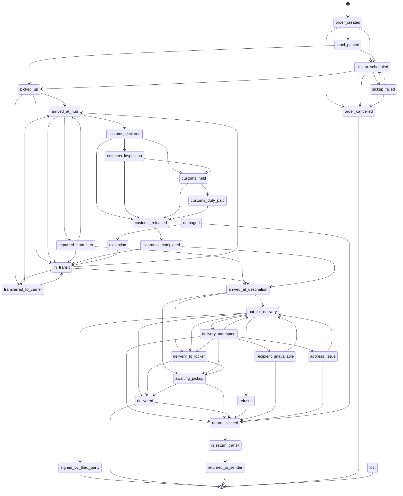

# ULSC 状态转移图

> v0.5 → v1.0 过渡 · 待社区评审

ULSC 32 个码不是平的——它们之间存在**合法的转移序列**。本文定义：
- 哪些转移是常规合法的（`picked_up → arrived_at_hub` ✓）
- 哪些是终态（`delivered` 通常不再有后续事件）
- 哪些是例外允许的（`delivered → return_initiated` 在 RMA 场景）
- 哪些转移基本就是错（`delivered → picked_up` 多半是 bug）

**用途**:
- 数据质量评价 M13 (`% events matching valid state machine`)
- 消费方做事件流校验
- v1.0 schema 加 `previousOltsCode` 时的 validator
- 为前端 timeline UI 提供"下一步可能态"hint

## 状态分类

按"是否可能有后续事件"分类:

| 类别 | 含义 | 包含的 ULSC 码 |
|---|---|---|
| **Terminal** 终态 | 正常情况下不再有后续事件 | `delivered` / `returned_to_sender` / `order_cancelled` / `lost` |
| **Exceptional** 异常态 | 可能进入终态也可能继续 | `damaged` / `exception` / `refused` |
| **Active** 流程中态 | 必然有后续事件 | 其他 25 个码 |

## 主要合法转移（按业务流）

### 正常派送流（happy path）

```
order_created
    → label_printed (可选)
    → pickup_scheduled (可选)
    → picked_up
    → arrived_at_hub
    → departed_from_hub
    → in_transit (可选，跨多个 hub)
    → arrived_at_destination
    → out_for_delivery
    → delivered             ★ terminal
```

跨境段在 `arrived_at_hub` / `departed_from_hub` 之间穿插：

```
    → customs_declared
    → customs_inspection (可选)
    → customs_held (异常)
    → customs_duty_paid (可选)
    → customs_released
    → clearance_completed
```

### 派送失败 / 重试

```
out_for_delivery
    → delivery_attempted     # 第 1/2/3 次失败
    → out_for_delivery       # 重派
    → delivered              # 成功 ★
```

或:

```
delivery_attempted
    → delivery_to_locker     # 改投自提柜
    → awaiting_pickup
    → delivered              # 用户取走 ★
```

或:

```
delivery_attempted
    → recipient_unavailable   # 联系不上
    → return_initiated        # 多次失败启动退回
```

### 退回流（return）

```
delivery_attempted | refused | recipient_unavailable
    → return_initiated
    → in_return_transit
    → returned_to_sender     ★ terminal
```

或主动 RMA:

```
delivered (★ terminal usually)
    → return_initiated        # 例外: 客户发起退货
    → in_return_transit
    → returned_to_sender     ★
```

### 异常 / 损坏 / 丢失

```
任意态 → exception            # 通用异常
任意态 → damaged              # 包裹损坏 (可恢复)
damaged → return_initiated     # 损坏 → 启动退回
任意态 → lost                  ★ terminal
```

### 揽收阶段

```
order_created
    → pickup_scheduled
    → picked_up               # 成功
    或
    → pickup_failed           # 失败 (可重试或终止)
    → pickup_scheduled        # 重新约
    或
    → order_cancelled         ★ terminal
```

## 状态机 Mermaid 图



## 完整转移矩阵

`✓` = 常规合法; `+` = 例外允许（需 metadata 解释）; `✗` = 不合法（多半 bug）

| from \ to | order_created | picked_up | in_transit | delivered | returned | exception |
|---|:-:|:-:|:-:|:-:|:-:|:-:|
| order_created | — | ✓ | + | ✗ | + | ✓ |
| picked_up | ✗ | — | ✓ | + | + | ✓ |
| in_transit | ✗ | ✗ | — | + | + | ✓ |
| delivered | ✗ | ✗ | ✗ | — | + (RMA) | ✓ |
| returned_to_sender | ✗ | ✗ | ✗ | ✗ | — | ✓ |
| (any) | — | — | — | — | — | ✓ (always) |

完整 32×32 转移矩阵作为单独 CSV (`ulsc/transitions.csv`) 在 v1.0 提供，
便于自动化 validator 加载。

## 校验函数提议

OLTS v1.0 实现可暴露 validator:

```python
from oltrack.state_machine import is_valid_transition

is_valid_transition(from_code="picked_up", to_code="arrived_at_hub")
# → True

is_valid_transition(from_code="delivered", to_code="picked_up")
# → False (with reason: "terminal state, cannot regress")

is_valid_transition(from_code="delivered", to_code="return_initiated", context={"rma": True})
# → True (with note: "RMA exception")
```

```typescript
import { isValidTransition } from "@oltrack/sdk";

isValidTransition("picked_up", "arrived_at_hub");   // true
isValidTransition("delivered", "picked_up");         // false
isValidTransition("delivered", "return_initiated", { rma: true });  // true
```

## v0.5 数据质量 M13 实现

```sql
-- 统计 invalid transitions 占比
WITH ordered AS (
  SELECT
    tracking_number,
    olts_code,
    LAG(olts_code) OVER (PARTITION BY tracking_number ORDER BY event_time) AS prev_code
  FROM olts_events
  WHERE event_time > now() - interval '7 days'
),
invalid AS (
  SELECT *
  FROM ordered o
  LEFT JOIN ulsc_transitions t
    ON t.from_code = o.prev_code AND t.to_code = o.olts_code
  WHERE o.prev_code IS NOT NULL
    AND t.to_code IS NULL  -- transition not in valid set
)
SELECT
  100.0 * (SELECT COUNT(*) FROM ordered WHERE prev_code IS NOT NULL) -
  100.0 * (SELECT COUNT(*) FROM invalid)
  / NULLIF((SELECT COUNT(*) FROM ordered WHERE prev_code IS NOT NULL), 0)
  AS m13_valid_transition_pct;
```

## 边缘情况说明

### 1. 同一 olts_code 重复

许多承运商在同一状态下推多条事件（如多次 `in_transit` 描述不同 hub）。
本文不把"同 code 重复"视为转移——`A → A` 永远合法。

### 2. 时间倒序事件

承运商偶尔会推送时间早于已收到事件的"补登"。validator 应按 `eventTime`
排序后再做转移校验，不按接收顺序。

### 3. 多 piece 运单

每个 piece 有自己的事件流；状态机校验按 piece 而非按 shipment 进行。
shipment 整体的 currentStatus 可以是 "min" 状态（最早未完成的 piece）。

### 4. 跨境清关分支

`customs_declared` → `customs_held` 是常见路径但不必然——很多场景直接
`customs_declared` → `customs_released`（直接放行）。validator 不应要求
全清关码必须出现。

## 反馈

- 不合理的转移定义？→ 提 Issue，附 carrier + 实际事件序列
- 缺失的合法转移？→ 同上
- v1.0 plan: `ulsc/transitions.csv` 矩阵化 + `oltrack.state_machine` /
  `@oltrack/sdk/state-machine` 实现
